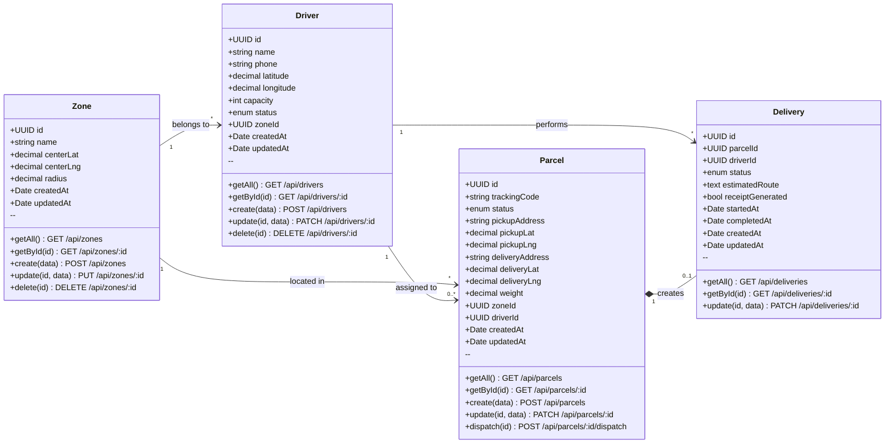

# LogistiMa - Diagramme des Tables avec Méthodes Controllers

## Légende des Relations UML

| Symbole | Type | Signification |
|---------|------|---------------|
| `-->` | **Association** | Relation simple, les objets existent indépendamment |
| `--o` | **Agrégation** | "Has-a", l'enfant peut exister sans le parent |
| `*--` | **Composition** | Relation forte, l'enfant ne peut pas exister sans le parent |

## Relations du Projet

| Relation | Type | Cardinalité | Explication |
|----------|------|-------------|-------------|
| Zone → Driver | Association | 1:N | Un driver appartient à une zone (FK obligatoire) |
| Zone → Parcel | Association | 1:N | Un colis est localisé dans une zone |
| Driver → Parcel | Association | 1:0..N | Un driver peut avoir 0 ou plusieurs colis assignés |
| Driver → Delivery | Association | 1:N | Un driver effectue plusieurs livraisons |
| Parcel → Delivery | **Composition** | 1:0..1 | La delivery est créée à partir du parcel et ne peut exister sans lui |

## Résumé des Endpoints par Table

| Table | Méthode | Endpoint | Description |
|-------|---------|----------|-------------|
| **Zone** | GET | `/api/zones` | Liste toutes les zones (depuis cache Redis) |
| | GET | `/api/zones/:id` | Récupère une zone par ID |
| | POST | `/api/zones` | Crée une nouvelle zone |
| | PUT | `/api/zones/:id` | Met à jour une zone |
| | DELETE | `/api/zones/:id` | Supprime une zone |
| **Driver** | GET | `/api/drivers` | Liste tous les livreurs |
| | GET | `/api/drivers/:id` | Récupère un livreur par ID |
| | POST | `/api/drivers` | Crée un nouveau livreur |
| | PATCH | `/api/drivers/:id` | Met à jour un livreur |
| | DELETE | `/api/drivers/:id` | Supprime un livreur |
| **Parcel** | GET | `/api/parcels` | Liste tous les colis |
| | GET | `/api/parcels/:id` | Récupère un colis par ID |
| | POST | `/api/parcels` | Crée un nouveau colis |
| | PATCH | `/api/parcels/:id` | Met à jour un colis |
| | **POST** | **`/api/parcels/:id/dispatch`** | **Dispatche le colis à un livreur** |
| **Delivery** | GET | `/api/deliveries` | Liste toutes les livraisons |
| | GET | `/api/deliveries/:id` | Récupère une livraison par ID |
| | PATCH | `/api/deliveries/:id` | Met à jour le statut d'une livraison |

## Enums

| Enum | Valeurs |
|------|---------|
| `DriverStatus` | `available`, `busy`, `offline` |
| `ParcelStatus` | `pending`, `assigned`, `in_transit`, `delivered`, `cancelled` |
| `DeliveryStatus` | `pending`, `in_progress`, `completed`, `failed` |
